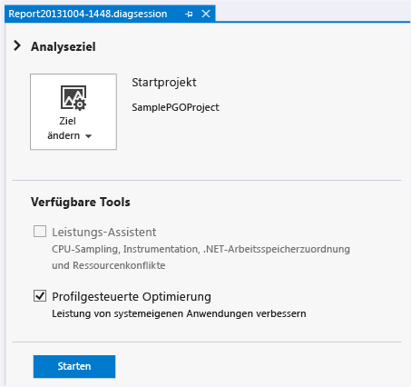
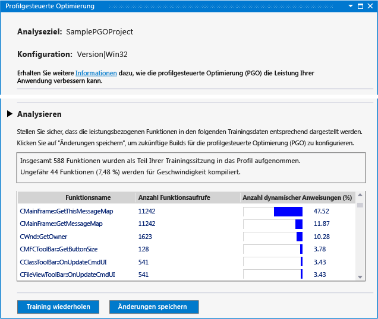
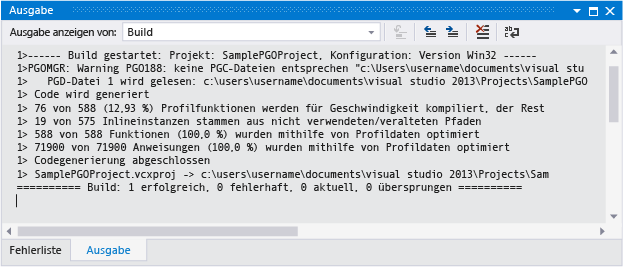

# Profilgesteuerte Optimierung im Leistungs- und Diagnosehub
[!INCLUDE[vs2017banner](../../assembler/inline/includes/vs2017banner.md)]

Die profilgesteuerte Optimierung für das Visual C\+\+\-Plug\-In im Leistungs\- und Diagnose\-Hub vereinfacht die profilgesteuerte Optimierung für Entwickler.  Sie können das Plug\-In von der Visual Studio\-Website [herunterladen](http://go.microsoft.com/fwlink/p/?LinkId=327915).  
  
 Mit der profilgesteuerten Optimierung \(PGO\) können Sie Builds systemeigener x86\- und x64\-Apps erstellen, die für die Interaktion mit den Benutzern optimiert sind.  Die profilgesteuerte Optimierung ist ein mehrstufiger Prozess: Sie erstellen einen App\-Build, der für die Profilerstellung instrumentiert wird. Dann führen Sie das "Training" durch, das heißt, Sie führen die instrumentierte App mit gängigen Benutzerinteraktionsszenarien aus.  Sie speichern die aufgezeichneten Profilerstellungsdaten und erstellen dann die App erneut unter Verwendung der Ergebnisse, um die Optimierung des gesamten Programms zu steuern.  Sie können diese Schritte zwar auch einzeln in Visual Studio oder in der Befehlszeile ausführen, das Plug\-In für die profilgesteuerte Optimierung zentralisiert und vereinfacht jedoch den Prozess.  Das Plug\-In für die profilgesteuerte Optimierung legt alle erforderlichen Optionen fest und führt Sie durch jeden Schritt. Es zeigt Ihnen die Analyse und verwendet anschließend die Ergebnisse, um den Build zu konfigurieren und so jede Funktion im Hinblick auf Größe oder Geschwindigkeit zu optimieren.  Das Plug\-In für die profilgesteuerte Optimierung macht es auch einfacher, Ihr App\-Training erneut auszuführen und die Build\-Optimierungsdaten bei Änderung des Code zu aktualisieren.  
  
## Erforderliche Komponenten  
 Sie müssen das [Plug\-In für die profilgesteuerte Optimierung herunterladen](http://go.microsoft.com/fwlink/p/?LinkId=327915) und in Visual Studio installieren, bevor Sie es im Leistungs\- und Diagnose\-Hub verwenden können.  
  
## Exemplarische Vorgehensweise: Verwenden des Plug\-In für die profilgesteuerte Optimierung, um eine Anwendung zu optimieren  
 Zuerst erstellen Sie eine einfache Win32\-Desktop\-App in Visual Studio.  Wenn Sie bereits über eine systemeigene App verfügen, die Sie optimieren möchten, können Sie diese verwenden und diesen Schritt überspringen.  
  
#### So erstellen Sie eine App  
  
1.  Wählen Sie in der Menüleiste **Datei**, **Neu**, **Projekt** aus.  
  
2.  Erweitern Sie im linken Bereich des Dialogfelds **Neues Projekt** die Einträge **Installiert**, **Vorlagen** und **Visual C\+\+**, und wählen Sie **MFC** aus.  
  
3.  Wählen Sie im mittleren Bereich die Option **MFC\-Anwendung** aus.  
  
4.  Geben Sie in das Feld **Name** einen Namen für das Projekt ein, z. B. "SamplePGOProject".  Klicken Sie auf die Schaltfläche **OK**.  
  
5.  Wählen Sie auf der Seite **Übersicht** des Dialogfelds **MFC\-Anwendungs\-Assistent** die Schaltfläche **Fertig stellen** aus.  
  
 Legen Sie anschließend die Buildkonfiguration der App auf "Freigabe" fest, um sie für die PGO\-Build\- und \-Trainingsschritte vorzubereiten.  
  
#### So legen Sie die Buildkonfiguration fest  
  
1.  Wählen Sie auf der Menüleiste die Option **Erstellen** und dann **Konfigurations\-Manager** aus.  
  
2.  Wählen Sie in der Dropdownliste **Konfiguration der aktuellen Projektmappe** im Dialogfeld **Konfigurations\-Manager** die Option **Freigabe** aus.  Wählen Sie die Schaltfläche **Schließen** aus.  
  
 Öffnen Sie das Leistungs\- und Diagnose\-Hub in der Menüleiste, und wählen Sie **Analysieren**, **Leistung und Diagnose** aus.  Dadurch wird eine Diagnosesitzungsseite geöffnet. Diese enthält die Analysetools, die für den Projekttyp verfügbar sind.  
  
   
  
 Aktivieren Sie unter **Verfügbare Tools** das Kontrollkästchen **Profilgesteuerte Optimierung**.  Wählen Sie die Schaltfläche **Starten** aus, um das Plug\-In für die profilgesteuerte Optimierung zu starten.  
  
   
  
 Auf der Seite **Profilgesteuerte Optimierung** werden die Schritte beschrieben, die das Plug\-In verwendet, um die Leistung der Anwendung zu verbessern.  Klicken Sie auf die Schaltfläche **Starten**.  
  
   
  
 Verwenden Sie im Abschnitt **Messung** die Option **Training ist bei Beginn aktiviert**, um auszuwählen, ob die Anlaufphase der App als Teil des Trainings enthalten ist.  Wenn diese Option nicht ausgewählt ist, werden die Trainingsdaten nicht in einer ausgeführten instrumentierten App aufgezeichnet, bis Sie das Training explizit aktivieren.  
  
 Wählen Sie die Schaltfläche **Instrumentieren** aus, um die Anwendung mit besonderen Compileroptionen zu erstellen.  Der Compiler fügt Testanweisungen im generierten Code ein.  Durch diese Anweisungen werden Profilerstellungsdaten während der Trainingsphase aufgezeichnet.  
  
   
  
 Wenn das instrumentierte Build der App abgeschlossen ist, wird die App automatisch gestartet.  
  
 Falls Fehler oder Warnungen während des Builds auftreten, korrigieren Sie diese, und wählen Sie dann die Option **Build neu starten**, um den instrumentierten Build neu zu starten.  
  
 Wenn die App gestartet wird, können Sie mit den Links **Training starten** und **Training anhalten** im Abschnitt **Training** steuern, wann Profilerstellungsinformationen aufgezeichnet werden.  Über die Links **Anwendung beenden** und **Anwendung starten** können Sie die Anwendung beenden und neu starten.  
  
   
  
 Gehen Sie während des Trainings die Benutzerszenarios durch, um die Profilerstellungsinformationen zu erfassen, die das Plug\-In für die profilgesteuerte Optimierung benötigt, um den Code zu optimieren.  Wenn Sie das Training abgeschlossen haben, schließen Sie die App, oder wählen Sie den Link **Anwendung beenden** aus.  Wählen Sie die Schaltfläche **Analysieren** aus, um den Analyseschritt zu starten.  
  
 Wenn die Analyse abgeschlossen ist, wird im Abschnitt **Analyse** ein Bericht mit den Profilerstellungsinformationen angezeigt, die während der Trainingsphase des Benutzerszenarios aufgezeichnet wurden.  Sie können diesen Bericht verwenden, um zu überprüfen, welche Funktionen von der App am meisten aufgerufen und am längsten verwendet wurden.  Das Plug\-In für die profilgesteuerte Optimierung verwendet die Informationen, um zu bestimmen, welche App\-Funktionen hinsichtlich der Geschwindigkeit und welche hinsichtlich der Größe optimiert werden sollten.  Das Plug\-In konfiguriert Buildoptimierungen, um die kleinste und schnellste App für die Benutzerszenarios zu erstellen, die Sie während des Trainings aufgezeichnet haben.  
  
   
  
 Wenn beim Training die erwarteten Profilerstellungsinformationen erfasst wurden, können Sie **Änderungen speichern** auswählen, um die analysierten Profildaten im Projekt zu speichern und so zukünftige Builds zu optimieren.  Um die Profildaten zu verwerfen und das Training von Beginn an zu starten, wählen Sie **Training wiederholen** aus.  
  
 Die Profildatendatei wird im Projekt in einem Ordner namens **PGO Training Data** gespeichert.  Diese Daten werden verwendet, um die Buildoptimierungseinstellungen des Compilers in der App zu steuern.  
  
   
  
 Nach der Analyse stellt das Plug\-In die Buildoptionen in Ihrem Projekt so ein, dass die Profildaten verwendet werden, um die App während der Kompilierung selektiv zu optimieren.  Sie können die App auch weiterhin mit denselben Profildaten ändern und erstellen.  Wenn die App erstellt wird, zeigen die Buildausgabeberichte, wie viele Funktionen und Anweisungen anhand der Profildaten optimiert wurden.  
  
   
  
 Wenn Sie während der Entwicklung bedeutende Codeänderungen vornehmen, müssen Sie das Training für die App unter Umständen wiederholen, um eine bestmögliche Optimierung zu erhalten.  Es wird empfohlen, das Training für die App zu wiederholen, wenn die Buildausgabeberichte besagen, dass weniger als 80 Prozent Funktionen oder Anweisungen anhand der Profildaten optimiert wurden.