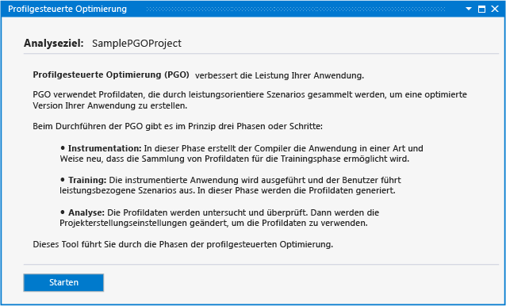
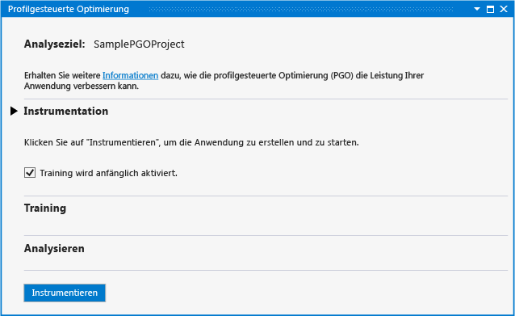
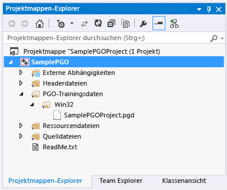

# Profilgesteuerte Optimierung im Visual Studio 2013-Leistung und Diagnose-Hub

Bei Verwendung von Visual Studio 2013 optimiert die profilgesteuerte Optimierung für Visual C++-Plug-in im Leistungs-und Diagnosehubs die profilgesteuerte Optimierung Erfahrung für Entwickler. Sie können [herunterladen, das plug-in](http://go.microsoft.com/fwlink/p/?LinkId=327915) aus der Visual Studio-Website. Das plug-in wird nicht in höheren Versionen von Visual Studio unterstützt.

Mit der profilgesteuerten Optimierung (PGO) können Sie Builds systemeigener x86- und x64-Apps erstellen, die für die Interaktion mit den Benutzern optimiert sind. Profilgesteuerte Optimierung ist ein mehrstufiger Prozess: Sie erstellen einen app-Build, der für die profilerstellung instrumentiert wird und dann führen Sie "Training". D. h., führen Sie die instrumentierte app mit gängigen benutzerinteraktionsszenarien. Sie speichern die aufgezeichneten Profilerstellungsdaten und erstellen dann die App erneut unter Verwendung der Ergebnisse, um die Optimierung des gesamten Programms zu steuern. Sie können diese Schritte zwar auch einzeln in Visual Studio oder in der Befehlszeile ausführen, das Plug-In für die profilgesteuerte Optimierung zentralisiert und vereinfacht jedoch den Prozess. Das Plug-In für die profilgesteuerte Optimierung legt alle erforderlichen Optionen fest und führt Sie durch jeden Schritt. Es zeigt Ihnen die Analyse und verwendet anschließend die Ergebnisse, um den Build zu konfigurieren und so jede Funktion im Hinblick auf Größe oder Geschwindigkeit zu optimieren. Das Plug-In für die profilgesteuerte Optimierung macht es auch einfacher, Ihre App-Aus- und Weiterbildung erneut auszuführen und die Build-Optimierungsdaten bei Änderung des Code zu aktualisieren.

## Erforderliche Komponenten

Sie müssen [-Plug-In für die profilgesteuerte Optimierung herunterladen](http://go.microsoft.com/fwlink/p/?LinkId=327915) und in Visual Studio installieren, bevor Sie ihn in die Leistung und Diagnose-Hub verwenden können.

## Exemplarische Vorgehensweise: Verwenden des Plug-In für die profilgesteuerte Optimierung, um eine Anwendung zu optimieren

Zuerst erstellen Sie eine einfache Win32-Desktop-App in Visual Studio. Wenn Sie bereits über eine systemeigene App verfügen, die Sie optimieren möchten, können Sie diese verwenden und diesen Schritt überspringen.

### So erstellen Sie eine App

1. Wählen Sie in der Menüleiste **Datei** > **Neu** > **Projekt** aus.

1. Im linken Bereich des der **neues Projekt** Dialogfeld erweitern Sie **installiert**, **Vorlagen**, **Visual C++**, und wählen Sie dann  **MFC**.

1. Wählen Sie im mittleren Bereich **MFC-Anwendung**.

1. Geben Sie einen Namen für das Projekt – z. B. **SamplePGOProject**– in der **Namen** Feld. Klicken Sie auf die Schaltfläche **OK** .

1. Auf der **Übersicht** auf der Seite der **MFC-Anwendung-Assistent** Dialogfeld Wählen Sie die **Fertig stellen** Schaltfläche.

Legen Sie anschließend die Buildkonfiguration der App auf „Freigabe“ fest, um sie für die PGO-Build- und -Trainingsschritte vorzubereiten.

### So legen Sie die Buildkonfiguration fest

1. Wählen Sie auf der Menüleiste die Option **Erstellen**und dann **Konfigurations-Manager**aus.

1. In der **Configuration Manager** Dialogfeld Wählen Sie die **aktive Projektmappenkonfiguration** Dropdown-Schaltfläche und wählen Sie **Version**. Wählen Sie die **schließen** Schaltfläche.

Öffnen Sie die Leistung und Diagnose-Hub – wählen Sie in der Menüleiste **analysieren**, **Leistung und Diagnose**. Dadurch wird eine Diagnosesitzungsseite geöffnet. Diese enthält die Analysetools, die für den Projekttyp verfügbar sind.

In **verfügbare Tools**, wählen die **Profilgesteuerte Optimierung** Kontrollkästchen. Wählen Sie die **starten** Schaltfläche-Plug-In für die profilgesteuerte Optimierung zu starten.

Die **Profilgesteuerte Optimierung** Seite beschreibt die Schritte zum Verbessern der Leistung Ihrer App das plug-in verwendet. Wählen Sie die **starten** Schaltfläche.

In der **Instrumentation** Abschnitt, verwenden Sie die **Training ist bei Beginn aktiviert** Option aus, um zu entscheiden, ob die Anlaufphase der app als Teil des Trainings enthalten soll. Wenn diese Option nicht ausgewählt ist, werden die Aus- und Weiterbildungsdaten nicht in einer ausgeführten instrumentierten App aufgezeichnet, bis Sie die Aus- und Weiterbildung explizit aktivieren.

Wählen Sie die **Instrument** Schaltfläche, um Ihre app mit einem bestimmten Satz von Compileroptionen zu erstellen. Der Compiler fügt Testanweisungen im generierten Code ein. Durch diese Anweisungen werden Profilerstellungsdaten während der Aus- und Weiterbildungsphase aufgezeichnet.

Wenn das instrumentierte Build der App abgeschlossen ist, wird die App automatisch gestartet.

Wenn Fehler oder Warnungen während des Builds auftreten, beheben sie die Fehler, und wählen Sie dann **Build neu starten** den instrumentierten Build neu zu starten.

Wenn die app gestartet wird, können Sie die **Training starten** und **Training anhalten** links in der **Training** Abschnitt aus, um zu steuern, wann Profilerstellungsinformationen aufgezeichnet werden. Sie können die **Anwendung beenden** und **Anwendung starten** Links zu beenden und Neustarten die app.

Gehen Sie während der Aus- und Weiterbildung die Benutzerszenarios durch, um die Profilerstellungsinformationen zu erfassen, die das Plug-In für die profilgesteuerte Optimierung benötigt, um den Code zu optimieren. Wenn Sie das Training abgeschlossen haben, schließen Sie die app, oder wählen Sie die **Anwendung beenden** Link. Wählen Sie die **analysieren** Schaltfläche, um den Analyseschritt zu starten.

Wenn die Analyse abgeschlossen ist, wird die **Analyse** Abschnitt zeigt einen Bericht mit den Profilerstellungsinformationen, die während der Benutzer trainingsphase des Benutzerszenarios aufgezeichnet wurden. Sie können diesen Bericht verwenden, um zu überprüfen, welche Funktionen von der App am meisten aufgerufen und am längsten verwendet wurden. Das Plug-In für die profilgesteuerte Optimierung verwendet die Informationen, um zu bestimmen, welche App-Funktionen hinsichtlich der Geschwindigkeit und welche hinsichtlich der Größe optimiert werden sollten. Das Plug-In konfiguriert Buildoptimierungen, um die kleinste und schnellste App für die Benutzerszenarios zu erstellen, die Sie während der Aus- und Weiterbildung aufgezeichnet haben.

Wenn das Training die erwarteten Profilerstellungsinformationen erfasst wurden, können Sie auswählen **Änderungen speichern** speichern die analysierten Profildaten im Projekt auf zukünftige Builds zu optimieren. Um die Profildaten zu verwerfen, und das Training erneut vom Anfang zu beginnen, wählen Sie **Training wiederholen**.

Die Profildatendatei wird gespeichert, in Ihrem Projekt in einem **PGO Training Data** Ordner. Diese Daten werden verwendet, um die Buildoptimierungseinstellungen des Compilers in der App zu steuern.

Nach der Analyse stellt das Plug-In die Buildoptionen in Ihrem Projekt so ein, dass die Profildaten verwendet werden, um die App während der Kompilierung selektiv zu optimieren. Sie können die App auch weiterhin mit denselben Profildaten ändern und erstellen. Wenn die App erstellt wird, zeigen die Buildausgabeberichte, wie viele Funktionen und Anweisungen anhand der Profildaten optimiert wurden.

Wenn Sie während der Entwicklung bedeutende Codeänderungen vornehmen, müssen Sie das Training für die App unter Umständen wiederholen, um eine bestmögliche Optimierung zu erhalten. Es wird empfohlen, das Training für die App zu wiederholen, wenn die Buildausgabeberichte besagen, dass weniger als 80 Prozent Funktionen oder Anweisungen anhand der Profildaten optimiert wurden.