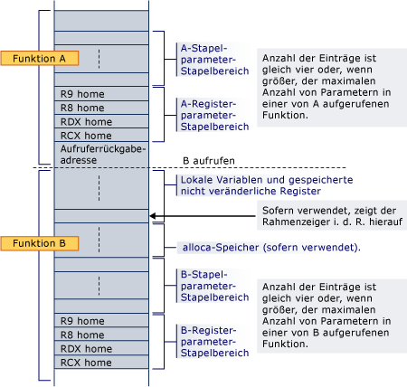

# Stapelreservierung
[!INCLUDE[vs2017banner](../assembler/inline/includes/vs2017banner.md)]

Der Prolog einer Funktion ist verantwortlich für die Reservierung von Stapelspeicher für lokale Variablen, gespeicherte Register, Stapelparameter und Registerparameter.  
  
 Der Parameterbereich befindet sich immer am Anfang des Stapels \(auch bei Verwendung von alloca\), sodass er bei einem Funktionsaufruf immer unmittelbar auf die Rückgabeadresse folgt.  Er enthält mindestens vier Einträge, stellt aber in jedem Fall genügend Speicherplatz für alle Parameter einer aufgerufenen Funktion zur Verfügung.  Beachten Sie, dass für die Registerparameter immer Speicher reserviert wird, auch wenn sich die Parameter selbst nie im Stapel befinden. Für jeden Aufgerufenen ist sichergestellt, dass Speicher für alle seine Parameter reserviert wurde.  Für Registerargumente sind Basisadressen erforderlich, sodass ein zusammenhängender Bereich verfügbar ist, wenn die aufgerufene Funktion die Adresse der Argumentliste \(va\_list\) oder ein einzelnes Argument verwenden muss.  Dieser Bereich bietet außerdem einen geeigneten Platz zum Speichern von Registerargumenten während der Thunk\-Ausführung und als Debug\-Option \(z. B. können Argumente während des Debuggens leichter gefunden werden, wenn diese unter ihrer Basisadresse im Prolog\-Code gespeichert sind\).  Selbst wenn die aufgerufene Funktion über weniger als vier Parameter verfügt, sind diese vier Speicherpositionen effektiv im Besitz der aufgerufenen Funktion und können von dieser auch für andere Zwecke als zum Speichern von Parameterregisterwerten verwendet werden.  Der Aufrufer darf daher über einen Funktionsaufruf hinweg keine Informationen in diesem Bereich des Stapels speichern.  
  
 Wenn Speicher in einer Funktion dynamisch reserviert wird \(alloca\), muss ein nicht veränderliches Register als Framezeiger verwendet werden, um die Basis des festen Teils des Stapels zu markieren. Dieses Register muss im Prolog gespeichert und initialisiert werden.  Beachten Sie bei der Verwendung von alloca, dass mehrfache Aufrufe des Aufgerufenen durch denselben Aufrufer möglicherweise unterschiedliche Basisadressen für ihre Registerparameter haben.  
  
 Der Stapel wird immer in 16 Byte\-Blöcken verwaltet, außer innerhalb des Prologs \(z. B. nachdem die Rückgabeadresse abgelegt wurde\) und wenn dies in [Funktionstypen](../build/function-types.md) für eine bestimmte Klasse von Rahmenfunktionen anders angegeben wurde.  
  
 Es folgt das Beispiel eines Stapellayouts, bei dem Funktion A eine nicht verzweigende Funktion B aufruft.  Vom Prolog der Funktion A wurde am Anfang des Stapels bereits Speicher für alle von Funktion B benötigten Register\- und Stapelparameter reserviert.  Der Aufruf legt die Rückgabeadresse ab, und der Prolog von Funktion B reserviert Speicher für seine lokalen Variablen, nicht veränderliche Register und den Speicher für eigene Funktionsaufrufe.  Wenn Funktion B alloca verwendet, wird der Speicher zwischen dem Speicherbereich der lokalen Variablen\/nicht veränderlichen Register und dem Parameterstapelbereich reserviert.  
  
   
  
 Wenn Funktion B eine andere Funktion aufruft, wird die Rückgabeadresse direkt unterhalb der Basisadresse für RCX abgelegt.  
  
## Siehe auch  
 [Verwendung von Stapeln](../build/stack-usage.md)