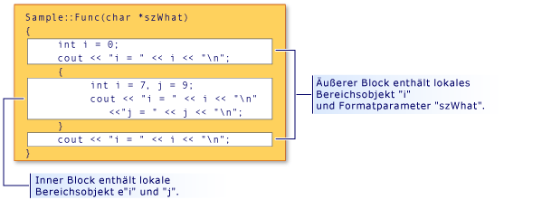

# Bereich (Visual C++)
[!INCLUDE[vs2017banner](../assembler/inline/includes/vs2017banner.md)]

C\+\+\-Namen können nur in bestimmten Bereichen eines Programms verwendet werden.  Dieser Bereich wird als Gültigkeitsbereich des Namens bezeichnet.  Der Gültigkeitsbereich bestimmt die Lebensdauer eines Namens, der kein statisches Objekt angibt.  Der Gültigkeitsbereich bestimmt außerdem die Sichtbarkeit eines Namens, wenn Klassenkonstruktoren und \-destruktoren aufgerufen werden, und wenn lokale Gültigkeitsbereichsvariablen initialisiert werden.  \(Weitere Informationen finden Sie unter [Konstruktoren](../cpp/constructors-cpp.md) und [Destruktoren](../cpp/destructors-cpp.md)\). Es gibt fünf Arten von Gültigkeitsbereichen:  
  
-   **Lokaler Gültigkeitsbereich** Auf einen Namen, der in einem Block deklariert wird, kann nur innerhalb dieses Blocks und den von diesem umschlossenen Blöcken und nur nach dem Zeitpunkt der Deklaration zugegriffen werden.  Die Namen von formalen Argumenten für eine Funktion im Gültigkeitsbereich des äußersten Funktionsblocks haben lokale Gültigkeit, so als ob sie direkt im Block deklariert wurden, der den Funktionstext einschließt.  Betrachten Sie das folgende Codefragment:  
  
    ```  
    {  
        int i;  
    }  
    ```  
  
     Da die Deklaration von `i` in einem Block ist, der von geschweiften Klammern eingeschlossen wird, hat `i` lokale Gültigkeit und ist nie zugänglich, weil kein Code vor der schließenden Klammer darauf zugreift.  
  
-   **Funktionsgültigkeitsbereich** Bezeichnungen sind die einzigen Namen, die einen Funktionsgültigkeitsbereich haben.  Sie können überall innerhalb einer Funktion verwendet werden. Außerhalb der Funktion kann aber nicht auf sie zugegriffen werden.  Formale Argumente \(Argumente, die in den Funktionsdefinitionen angegeben sind\) auf Funktionen gelten als im Gültigkeitsbereich des äußersten Blocks des Funktionstexts.  
  
-   **Dateigültigkeitsbereich** Jeder Name, der außerhalb aller Blöcke oder Klassen deklariert wird, hat einen Dateigültigkeitsbereich.  Auf ihn kann nach seiner Deklaration in der gesamten Übersetzungseinheit zugegriffen werden.  Namen mit Dateigültigkeitsbereich, die keine statischen Objekte deklarieren, werden oft als globale Namen bezeichnet.  
  
     In C\+\+ ist der Dateigültigkeitsbereich auch als Namespacegültigkeitsbereich bekannt.  
  
-   **Klassengültigkeitsbereich** Namen von Klassenmembern haben einen Klassengültigkeitsbereich.  Auf Klassenmemberfunktionen kann nur mithilfe der Memberauswahloperatoren \(**.** oder **–\>**\) oder der Zeiger\-auf\-Member\-Operatoren \(**.\*** oder **–\>\***\) für ein Objekt oder einen Zeiger auf ein Objekt dieser Klasse zugegriffen werden. Nicht statische Klassenmemberdaten werden für das Objekt dieser Klasse als lokal angesehen.  Betrachten Sie die folgende Klassendeklaration:  
  
    ```  
    class Point  
    {  
        int x;  
        int y;  
    };  
    ```  
  
     Die Klassenmember `x` und `y` werden als im Gültigkeitsbereich der Klasse `Point` betrachtet.  
  
-   **Prototypgültigkeitsbereich** Namen, die in einem Funktionsprototyp deklariert werden, sind nur bis zum Ende des Prototyps sichtbar.  Der folgende Prototyp deklariert drei Namen \(`strDestination`, `numberOfElements` und `strSource`\). Diese Namen verlassen am Ende des Prototyps den gültigen Bereich:  
  
    ```  
    errno_t strcpy_s( char *strDestination, size_t numberOfElements, const char *strSource );  
    ```  
  
## Ausblenden von Namen  
 Sie können einen Namen verbergen, indem Sie ihn in einem eingeschlossenen Block deklarieren.  In der folgenden Abbildung wird `i` innerhalb des inneren Blocks neu deklariert. Dadurch wird die Variable ausgeblendet, die `i` im äußeren Blockbereich zugeordnet ist.  
  
   
Blockbereich und Ausblenden von Namen  
  
 Die in der Abbildung dargestellte Ausgabe des Programms lautet wie folgt:  
  
```  
i = 0  
i = 7  
j = 9  
i = 0  
```  
  
> [!NOTE]
>  Es wird angenommen, dass das `szWhat`\-Argument im Funktionsbereich liegt.  Daher wird es so behandelt, als wäre es im äußersten Block der Funktion deklariert worden.  
  
## Ausblenden von Klassennamen  
 Sie können Klassennamen ausblenden, indem Sie eine Funktion, ein Objekt, eine Variable oder einen Enumerator im gleichen Bereich deklarieren.  Allerdings kann weiterhin auf den Klassennamen zugegriffen werden, sofern das Schlüsselwort **class** vorangestellt ist.  
  
```  
// hiding_class_names.cpp  
// compile with: /EHsc  
#include <iostream>  
using namespace std;  
  
// Declare class Account at file scope.  
class Account  
{  
public:  
    Account( double InitialBalance )  
        { balance = InitialBalance; }  
    double GetBalance()  
        { return balance; }  
private:  
    double balance;  
};  
  
double Account = 15.37;            // Hides class name Account  
  
int main()  
{  
    class Account Checking( Account ); // Qualifies Account as   
                                       //  class name  
  
    cout << "Opening account with balance of: "  
         << Checking.GetBalance() << "\n";  
}  
//Output: Opening account with balance of: 15.37  
```  
  
> [!NOTE]
>  Für jeden Ort, für den der Klassenname \(`Account`\) aufgerufen wird, muss zur Unterscheidung von der dateispezifischen Account\-Variable das class\-Schlüsselwort verwendet werden.  Diese Regel gilt nicht, wenn der Klassenname auf der linken Seite des Bereichsauflösungsoperators \(::\) auftritt.  Namen auf der linken Seite des Bereichsauflösungsoperators gelten immer als Klassennamen.  
  
 Im folgenden Beispiel wird veranschaulicht, wie ein Zeiger auf ein Objekt des Typs `Account` mit dem Schlüsselwort **class** deklariert wird:  
  
```  
class Account *Checking = new class Account( Account );  
```  
  
 Im Beispiel ist `Account` im Initialisierer \(in Klammern\) in der voranstehenden Anweisung dateispezifisch und weist den Typ **double** auf.  
  
> [!NOTE]
>  Die in diesem Beispiel dargestellte Wiederverwendung von Bezeichnernamen gilt als schlechter Programmierstil.  
  
 Weitere Informationen über Zeiger finden Sie unter [Abgeleitete Typen](assetId:///aa14183c-02fe-4d81-95fe-beddb0c01c7c).  Weitere Informationen über die Deklaration und Initialisierung von Klassenobjekten finden Sie unter [Klassen, Strukturen und Unions](../cpp/classes-and-structs-cpp.md).  Weitere Informationen über die Verwendung der freien Speicheroperatoren **new** und **delete** finden Sie unter [Spezielle Memberfunktionen](../misc/special-member-functions-cpp.md).  
  
## Ausblenden von Namen mit Dateibereich  
 Sie können Namen mit Dateigültigkeitsbereich ausblenden, indem Sie explizit den gleichen Namen im Blockbereich deklarieren.  Allerdings kann auf Namen mit einem Dateigültigkeitsbereich mithilfe des Bereichsauflösungsoperators \(`::`\) zugegriffen werden.  
  
```  
// file_scopes.cpp  
// compile with: /EHsc  
#include <iostream>  
  
int i = 7;   // i has file scope, outside all blocks  
using namespace std;  
  
int main( int argc, char *argv[] ) {  
   int i = 5;   // i has block scope, hides i at file scope  
   cout << "Block-scoped i has the value: " << i << "\n";  
   cout << "File-scoped i has the value: " << ::i << "\n";  
}  
```  
  
  **Blockbereichsbezogenes i hat den Wert: 5**  
**Dateibereichsbezogenes i hat den Wert: 7**   
## Siehe auch  
 [Grundlegende Konzepte](../cpp/basic-concepts-cpp.md)