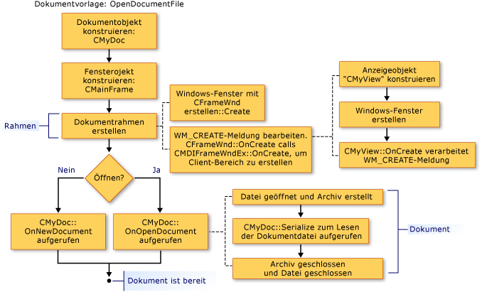

# Erstellen neuer Dokumente, Fenster und Ansichten
Die folgenden Abbildungen erhalten einen Überblick der Erstellungsvorgang für Dokumente, Ansichten und Rahmenfenster. Anderen Artikeln, die für die beteiligten Objekte zu konzentrieren. angeben Weitere Details.  
  
 Nach Abschluss dieses Vorgangs wird die kooperierender Objekte vorhanden sind, und Speichern von Zeigern miteinander. Die folgenden Abbildungen zeigen die Reihenfolge, in der Objekte erstellt werden. Sie können die Sequenz von Abbildung zu Abbildung entsprechen.  
  
   
Reihenfolge beim Erstellen eines Dokuments  
  
   
Reihenfolge beim Erstellen eines Rahmenfensters  
  
   
Reihenfolge beim Erstellen einer Ansicht  
  
 Informationen dazu, wie das Framework die neues Dokument, Ansicht und Rahmenfensterobjekt initialisiert, finden Sie in den Klassen [CDocument](../mfc/reference/cdocument-class.md), [CView](../mfc/reference/cview-class.md), [CFrameWnd](../mfc/reference/cframewnd-class.md), [CMDIFrameWnd](../mfc/reference/cmdiframewnd-class.md), und [CMDIChildWnd](../mfc/reference/cmdichildwnd-class.md) in der Verweis auf die MFC-Bibliothek. Siehe auch [technischen Hinweis 22](../mfc/tn022-standard-commands-implementation.md), dort die Erstellung und Initialisierung Prozesse weiter, unter dessen Erläuterung von Standardbefehlen, das Framework für die `New` und **öffnen** Elemente auf der **Datei** Menü.  
  
##  Initialisieren Ihre eigenen Ergänzungen für diese Klassen  
 Die vorhergehenden Abbildungen empfehlen auch die Punkte, an denen Sie, Memberfunktionen überschreiben können, um Ihre Anwendung Objekte zu initialisieren. Eine Überschreibung der `OnInitialUpdate` in Ihrer Ansicht Klasse ist die beste Stelle, um die Ansicht zu initialisieren. Die `OnInitialUpdate` Aufruf erfolgt sofort, nachdem das Rahmenfenster erstellt wird und die Ansicht im Rahmenfenster an sein Dokument angefügt ist. Angenommen, Ihre Ansicht einer Bildlaufleiste ist (abgeleitet `CScrollView` anstelle `CView`), sollten Sie die Größe der Ansicht basierend auf die Dokumentgröße in Festlegen Ihrer `OnInitialUpdate` außer Kraft setzen. (Dieser Prozess wird in der Beschreibung der Klasse beschrieben [CScrollView](../mfc/reference/cscrollview-class.md).) Sie können außer Kraft setzen die **CDocument** Memberfunktionen `OnNewDocument` und `OnOpenDocument` anwendungsspezifische Initialisierung des Dokuments angeben. In der Regel müssen Sie beide überschreiben, da ein Dokument auf zwei Arten erstellt werden kann.  
  
 In den meisten Fällen sollten Ihre Überschreibung die Basisklassenversion aufrufen. Weitere Informationen finden Sie unter den benannten Memberfunktionen von Klassen [CDocument](../mfc/reference/cdocument-class.md), [CView](../mfc/reference/cview-class.md), [CFrameWnd](../mfc/reference/cframewnd-class.md), und [CWinApp](../mfc/reference/cwinapp-class.md) in MFC Bibliotheksverweis.  
  
## Siehe auch  
 [Dokumentvorlagen und der Erstellungsvorgang für die Dokument-/Ansichtarchitektur](../mfc/document-templates-and-the-document-view-creation-process.md)   
 [Erstellen von Dokumentvorlagen](../mfc/document-template-creation.md)   
 [Erstellen von Dokument/Ansicht](../mfc/document-view-creation.md)   
 [Beziehungen zwischen MFC-Objekten](../mfc/relationships-among-mfc-objects.md)

