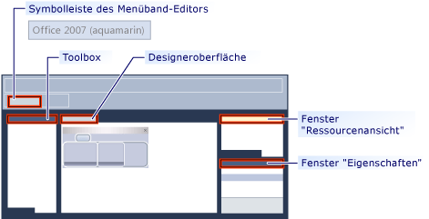

# Men&#252;band-Designer (MFC)
[!INCLUDE[vs2017banner](../assembler/inline/includes/vs2017banner.md)]

Mit dem Menüband\-Designer können Sie Menübänder in MFC\-Anwendungen erstellen und anpassen.  Ein Menüband ist ein Element der Benutzeroberfläche \(UI\), auf dem Befehle in logischen Gruppen organisiert werden.  Diese Gruppen werden auf separaten Registerkarten in einem Streifen entlang des oberen Fensterrahmens angezeigt.  Das Menüband ersetzt die Menü\- und Symbolleisten.  Mit einem Menüband kann die Benutzerfreundlichkeit von Anwendungen erheblich verbessert werden.  Weitere Informationen finden Sie unter [Menübänder](http://go.microsoft.com/fwlink/?LinkId=129233).  Die folgende Abbildung zeigt ein Menüband.  
  
   
  
 In früheren Versionen von Visual Studio musste zu Erstellen von Menübänder Code geschrieben werden, in dem die MFC\-Menübandklassen wie [CMFCRibbonBar Class](../mfc/reference/cmfcribbonbar-class.md) verwendet wurden.  In [!INCLUDE[vs_dev10_long](../build/includes/vs_dev10_long_md.md)] stellt der Menüband\-Designer eine alternative Methode zum Erstellen von Menübändern dar. Zunächst erstellen Sie ein Menüband als Ressource und passen es an.  Dann laden Sie die Menübandressource vom Code in der MFC\-Anwendung.  Sie können Menübandressourcen und MFC\-Menübandklassen sogar zusammen verwenden.  Zum Beispiel können Sie eine Menübandressource erstellen und ihr dann mithilfe von Code zur Laufzeit programmgesteuert mehr Elemente hinzufügen.  
  
## Der Menüband\-Designer  
 Mit dem Menüband\-Designer wird das Menüband als Ressource erstellt und gespeichert.  Wenn Sie eine Menübandressource erstellen, werden vom Menüband\-Designer die folgenden drei Aktionen ausgeführt:  
  
-   Hinzufügen eines Eintrags im Projektressourcen\-Definitionsskript \(\*.rc\)  Im folgenden Beispiel ist `IDR_RIBBON` der eindeutige Name zum Identifizieren der Menübandressource, `RT_RIBBON_XML` ist der Ressourcentyp und `ribbon.mfcribbon-ms` ist der Name der Ressourcendatei.  
  
    ```  
    IDR_RIBBON             RT_RIBBON_XML                      "res\\ribbon.mfcribbon-ms"  
    ```  
  
-   Hinzufügen der Definitionen von Befehls\-IDs zur "resource.h"  
  
    ```  
    #define IDR_RIBBON            307  
    ```  
  
-   Eine Menübandressourcendatei \(\*.mfcribbon\-ms\), die den XML\-Code enthält, mit dem die Schaltflächen des Menübands, die Steuerelemente und Attribute im Menüband definiert werden, wird erstellt.  Änderungen, die im Menüband\-Designer am Menüband vorgenommen werden, werden in der Ressourcendatei als XML gespeichert.  Mit dem folgenden Codebeispiel wird ein Ausschnitt aus dem Inhalt einer \*.mfcribbon\-ms Datei dargestellt:  
  
    ```  
    <RIBBON_BAR>  
      <ELEMENT_NAME>RibbonBar</ELEMENT_NAME>  
      <IMAGE>  
        <ID>  
          <NAME>IDB_BUTTONS</NAME>  
          <VALUE>113</VALUE>  
        </ID> …  
    ```  
  
 Wenn Sie die Menübandressource in der MFC\-Anwendung verwenden möchten, laden Sie die Ressource herunter, indem Sie [CMFCRibbonBar::LoadFromResource](../Topic/CMFCRibbonBar::LoadFromResource.md) aufrufen.  
  
## Erstellen eines Menübands mit dem Menüband\-Designer  
 Dies sind die zwei Möglichkeiten, dem MFC\-Projekt eine Menübandressource hinzuzufügen:  
  
-   Erstellen einer MFC\-Anwendung und konfigurieren des MFC\-Projekt\-Assistenten zum Erstellen des Menübands.  Weitere Informationen finden Sie unter [Exemplarische Vorgehensweise: Erstellen einer Menübandanwendung mithilfe von MFC](../mfc/walkthrough-creating-a-ribbon-application-by-using-mfc.md).  
  
-   Erstellen Sie in einem vorhandenen MFC\-Projekt eine Menübandressource und laden Sie sie.  Weitere Informationen finden Sie unter [Exemplarische Vorgehensweise: Aktualisieren der MFC Scribble\-Anwendung \(Teil 1\)](../mfc/walkthrough-updating-the-mfc-scribble-application-part-1.md).  
  
 Wenn das Projekt bereits über ein manuell codiertes Menüband verfügt, können Sie das vorhandene Menüband mit MFC Funktionen in eine Menübandressource konvertieren.  Weitere Informationen finden Sie unter [Gewusst wie: Umwandeln eines vorhandenen MFC\-Menübands in eine Menübandressource](../mfc/how-to-convert-an-existing-mfc-ribbon-to-a-ribbon-resource.md).  
  
> [!NOTE]
>  Menübänder können nicht in Anwendungen erstellt werden, die auf Dialogfeldern basieren.  Weitere Informationen finden Sie unter [Anwendungstyp, MFC\-Anwendungs\-Assistent](../mfc/reference/application-type-mfc-application-wizard.md).  
  
## Anpassen von Menübändern  
 Um ein Menüband im Menüband\-Designer zu öffnen, doppelklicken Sie in der Ressourcenansicht auf die Menübandressource.  Im Designer können Sie dem Menüband, der Anwendungsschaltfläche oder der Symbolleiste für den Schnellzugriff Elemente hinzufügen, entfernen und anpassen.  Sie können auch Ereignisse, z. B. Klickereignisse einer Schaltfläche und Menüereignisse, mit einer Methode in der Anwendung verknüpfen.  
  
 Die folgende Abbildung zeigt die verschiedenen Komponenten im Menüband\-Designer.  
  
   
  
-   **Toolbox:** Enthält Steuerelemente, die auf die Designeroberfläche gezogen werden können.  
  
-   **Designer\-Oberfläche:** Enthält die visuelle Darstellung der Menübandressource.  
  
-   **Eigenschaftenfenster:** Führt die Attribute des auf der Designeroberfläche ausgewählten Elements auf.  
  
-   **Ressourcenansicht:** Zeigt die Ressourcen im Projekt an, die Menübandressourcen enthalten.  
  
-   **Menüband\-Editor\-Symbolleiste:** Enthält Befehle, mit denen Sie das Menüband in der Vorschau anzeigen und das visuelle Design ändern können.  
  
 In den folgenden Themen wird die Verwendung der Funktionen im Menüband\-Designer beschrieben:  
  
-   [Gewusst wie: Anpassen der Anwendungsschaltfläche](../mfc/how-to-customize-the-application-button.md)  
  
-   [Gewusst wie: Anpassen der Symbolleiste für den Schnellzugriff](../mfc/how-to-customize-the-quick-access-toolbar.md)  
  
-   [Gewusst wie: Hinzufügen von Menüband\-Steuerelementen und Ereignishandlern](../mfc/how-to-add-ribbon-controls-and-event-handlers.md)  
  
-   [Gewusst wie: Laden einer Menübandressource aus einer MFC\-Anwendung](../mfc/how-to-load-a-ribbon-resource-from-an-mfc-application.md)  
  
## Definitionen von Menübandelementen  
   
  
-   **Anwendungsschaltfläche:** Die Schaltfläche, die in der linken oberen Ecke eines Menübands angezeigt wird.  Die Anwendungsschaltfläche ersetzt das Datei\-Menü und ist sichtbar, wenn das Menüband minimiert wird.  Wenn auf die Schaltfläche geklickt wird, wird ein Menü mit einer Liste von Befehlen angezeigt.  
  
-   **Symbolleiste für den Schnellzugriff:** Eine kleine, anpassbare Symbolleiste, in der häufig verwendete Befehle angezeigt werden.  
  
-   **Kategorie**: die logische Gruppierung, in der der Inhalt einer Registerkarte des Menübands dargestellt wird.  
  
-   **Kategorien\-Standardschaltfläche:** Die Schaltfläche, die beim Minimieren des Menübands darauf angezeigt wird.  Wenn auf die Schaltfläche geklickt wird, erscheint die Kategorie als Menü neu.  
  
-   **Bereich:** Ein Bereich der Menübandleiste, in der eine Gruppe verwandter Steuerelemente angezeigt wird.  In jeder Menübandkategorie ist mindestens ein Menübandbereich enthalten.  
  
-   **Menübandelemente:** Steuerelemente in den Bereichen, z. B. Schaltflächen und Kombinationsfelder.  Die weiteren Steuerelemente, die auf einem Menüband gehostet werden können, finden Sie unter [RibbonGadgets\-Beispiel: Anwendung für Minianwendungen auf dem Menüband](../top/visual-cpp-samples.md).  
  
## Siehe auch  
 [Benutzeroberflächenelemente](../mfc/user-interface-elements-mfc.md)   
 [Working with Resource Files](../mfc/working-with-resource-files.md)