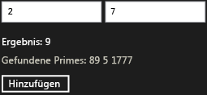

# Exemplarische Vorgehensweise: Erstellen einer Basiskomponente f&#252;r Windows-Runtime mit WRL
[!INCLUDE[vs2017banner](../assembler/inline/includes/vs2017banner.md)]

Dieses Dokument veranschaulicht, wie die [!INCLUDE[cppwrl](../windows/includes/cppwrl_md.md)] ([!INCLUDE[cppwrl_short](../windows/includes/cppwrl_short_md.md)]) zum Erstellen eines grundlegenden [!INCLUDE[wrt](../atl/reference/includes/wrt_md.md)] Komponente. Die Komponente addiert zwei Zahlen und löst ein Ereignis aus, wenn das Ergebnis eine Primzahl ist. Dieses Dokument wird auch veranschaulicht, wie die Komponente aus einem [!INCLUDE[win8_appname_long](../build/includes/win8_appname_long_md.md)] -app, JavaScript verwendet.  
  
## Erforderliche Komponenten  
  
-   Erfahrung mit der [Windows-Runtime](http://msdn.microsoft.com/library/windows/apps/br211377.aspx).  
  
-   Erfahrungen mit COM.  
  
### Zum Erstellen eines grundlegenden [!INCLUDE[wrt](../atl/reference/includes/wrt_md.md)] Komponente, die zwei Zahlen addiert  
  
1.  Erstellen Sie in Visual Studio ein Visual C++ `WRLClassLibrary` Projekt. Das Dokument [Projektvorlage für Klassenbibliothek](../windows/wrl-class-library-project-template.md) beschreibt, wie Sie diese Vorlage herunterladen. Benennen Sie das Projekt mit `Contoso`.  
  
2.  Ersetzen Sie in Contoso.cpp und Contoso.idl alle Instanzen von "WinRTClass" mit "Calculator".  
  
3.  Fügen Sie in Contoso.idl, die `Add` Methode, um die `ICalculator` Schnittstelle.  
  
     [!CODE [wrl-basic-component#1](../CodeSnippet/VS_Snippets_Misc/wrl-basic-component#1)]  
  
4.  In Contoso.cpp, fügen die `Add` Methode, um die `public` Teil der `Calculator` Klasse.  
  
     [!CODE [wrl-basic-component#2](../CodeSnippet/VS_Snippets_Misc/wrl-basic-component#2)]  
  
    > [!IMPORTANT]
    >  Da Sie eine COM-Komponente erstellen, geben Sie die `__stdcall` Aufrufkonvention.  
  
     Wir empfehlen die Verwendung `_Out_` und andere Quelle Annotation Language (SAL) Anmerkungen zu beschreiben, wie eine Funktion Parameter verwendet. SAL-Anmerkungen beschreiben auch Werte. SAL-Anmerkungen arbeiten mit der [C/C++-Codeanalysetool](../Topic/Code%20Analysis%20for%20C-C++%20Overview.md) um mögliche Fehler in C und C++-Quellcode zu ermitteln. Häufige Codefehler, die vom Tool gemeldet werden, zählen Pufferüberläufe, nicht initialisierter Speicher, Dereferenzierungen von null-Zeigern und Speicher- und Ressourcenverluste.  
  
### So verwenden Sie die Komponente aus einem [!INCLUDE[win8_appname_long](../build/includes/win8_appname_long_md.md)] app, die JavaScript nutzt  
  
1.  Fügen Sie in Visual Studio eine neue JavaScript `Blank App` -Projekt auf die `Contoso` Lösung. Benennen Sie das Projekt mit `CalculatorJS`.  
  
2.  In der `CalculatorJS` Projekt, fügen einen Verweis auf die `Contoso` Projekt.  
  
3.  Ersetzen Sie in der Datei "default.HTML", die `body` im Abschnitt mit den UI-Elementen:  
  
     [!CODE [wrl-basic-component#3](../CodeSnippet/VS_Snippets_Misc/wrl-basic-component#3)]  
  
4.  In "default.js" Implementieren der `OnClick` Funktion.  
  
     [!CODE [wrl-basic-component#4](../CodeSnippet/VS_Snippets_Misc/wrl-basic-component#4)]  
  
    > [!NOTE]
    >  In JavaScript wird der erste Buchstabe des einen Methodennamen entsprechend die standardmäßigen Benennungskonventionen in Kleinbuchstaben geändert.  
  
### Hinzufügen eines Ereignisses, das ausgelöst wird, wenn eine Primzahl berechnet wird  
  
1.  In Contoso.idl, vor der Deklaration des `ICalculator`, definieren Sie den Delegattyp `PrimeNumberEvent`, stellt ein `int` Argument.  
  
     [!CODE [wrl-basic-component#5](../CodeSnippet/VS_Snippets_Misc/wrl-basic-component#5)]  
  
     Bei Verwendung der `delegate` -Schlüsselwort, der MIDL-Compiler erstellt eine Schnittstelle, enthält eine `Invoke` Methode, die Signatur des Delegaten übereinstimmt. In diesem Beispiel wird die generierte Datei Contoso_h.h definiert die `IPrimeNumberEvent` -Schnittstelle, die später in dieser Prozedur verwendet wird.  
  
     [!CODE [wrl-basic-component#13](../CodeSnippet/VS_Snippets_Misc/wrl-basic-component#13)]  
  
2.  In der `ICalculator` Benutzeroberfläche, definieren die `PrimeNumberFound` Ereignis. Die `eventadd` und `eventremove` Attribute angeben, die der Consumer die `ICalculator` Schnittstelle abonnieren und abbestellen dieses Ereignis kann.  
  
     [!CODE [wrl-basic-component#6](../CodeSnippet/VS_Snippets_Misc/wrl-basic-component#6)]  
  
3.  Fügen Sie in Contoso.cpp, ein `private` [Microsoft::WRL::EventSource](../windows/eventsource-class.md) Membervariable, die Ereignisabonnenten verwalten und der Ereignishandler.  
  
     [!CODE [wrl-basic-component#7](../CodeSnippet/VS_Snippets_Misc/wrl-basic-component#7)]  
  
4.  In Contoso.cpp, implementieren die `add_PrimeNumberFound` und `remove_PrimeNumberFound` Methoden.  
  
     [!CODE [wrl-basic-component#8](../CodeSnippet/VS_Snippets_Misc/wrl-basic-component#8)]  
  
### Zum Auslösen des Ereignisses, wenn eine Primzahl berechnet wird  
  
1.  In Contoso.cpp, fügen die `IsPrime` Methode, um die `private` Teil der `Calculator` Klasse.  
  
     [!CODE [wrl-basic-component#12](../CodeSnippet/VS_Snippets_Misc/wrl-basic-component#12)]  
  
2.  Ändern der `Calculator`des `Add` aufzurufende Methode der [Microsoft::WRL::EventSource::InvokeAll](../windows/eventsource-invokeall-method.md) -Methode, wenn eine Primzahl berechnet wird.  
  
     [!CODE [wrl-basic-component#11](../CodeSnippet/VS_Snippets_Misc/wrl-basic-component#11)]  
  
### Für die Ereignisbehandlung aus JavaScript  
  
1.  Ändern Sie in der Datei "default.HTML", die `body` Abschnitt, um einen Textbereich enthalten, die Primzahlen enthält.  
  
     [!CODE [wrl-basic-component#9](../CodeSnippet/VS_Snippets_Misc/wrl-basic-component#9)]  
  
2.  Ändern Sie in default.js die `Add` Funktion behandelt die `PrimeNumberFound` Ereignis. Der Ereignishandler fügt die Primzahl in den Textbereich, der im vorherigen Schritt definiert wurde.  
  
     [!CODE [wrl-basic-component#10](../CodeSnippet/VS_Snippets_Misc/wrl-basic-component#10)]  
  
    > [!NOTE]
    >  In JavaScript die Ereignisnamen werden in Kleinbuchstaben geändert und vorangestellt, "auf", um den standardmäßigen Benennungskonventionen entsprechen.  
  
 Die folgende Abbildung zeigt die grundlegende Rechner-Anwendung.  
  
   
  
## Nächste Schritte  
  
## Siehe auch  
 [Windows-Runtime C++-Vorlagenbibliothek (WRL)](../windows/windows-runtime-cpp-template-library-wrl.md)   
 [Projektvorlage für Klassenbibliothek](../windows/wrl-class-library-project-template.md)   
 [C/C++-Codeanalysetool](../Topic/Code%20Analysis%20for%20C-C++%20Overview.md)